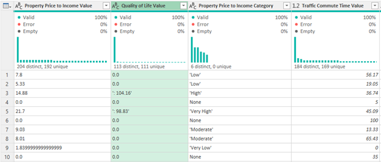
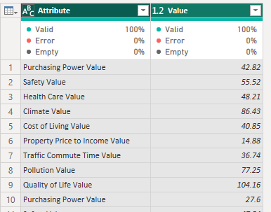

# Power BI Data Project: Global Quality of Life Index

# Overview

I chose this project as my second project due to my passion for travel and plans to relocate in the future. The project involves data exploration, cleaning, transformation, and manipulation, along data visualization that demonstrates my skills in using Power Query and visualization tools within Power BI. The dashboard aims to help travelers, expats, institutions, and organizations analyze and assess quality of life across countries. Sourced from Kaggle, the dataset includes quality-of-life metrics such as purchasing power, safety, healthcare, cost of living, traffic, pollution, and overall quality of life, offering both numerical scores and descriptive categories for a comprehensive analysis.

# Table of Contents

- [Objective](#objective)
- [Data Source](#data-source)
- [Stages](#stages)
- [Development](#development)
  - [Process Outline](#process-outline)
  - [Data Exploration](#data-exploration)
  - [Data Cleaning, Transforming & Testing](#data-cleaning-transforming--testing)
- [Visualization](#visualization)
  - [Dashboard](#dashboard)
  - [DAX Measures](#dax-measures)
  - [DAX Columns](#dax-columns)
- [Analysis & Findings](#analysis-and-findings)
- [Recommendations](#recommendations)

# Objective

To analyze global quality of life trends and disparities, offering insights for policymakers and researchers to guide development and resource allocation. This is also to help travelers and expats make informed decisions on relocation and travel, highlighting factors like safety, healthcare, and cost of living.

# Data Source

The [data](https://www.kaggle.com/datasets/ahmedmohamed2003/quality-of-life-for-each-country) is sourced from Kaggle (an Excel extract). The dataset consists of columns such as but not limited to:

| Column_Name | Description |
| --- | --- |
| country | Name of the country. |
| Purchasing Power Value | Numeric score for purchasing power |
| Purchasing Power Category | Qualitative category for purchasing power |
| Quality of Life Value | Numeric score for overall quality of life |
| Quality of Life Category | Qualitative quality of life category. | 
| Cost of Living Value | Numeric score for cost of living |
| Cost of Living Category | Qualitative cost of living category |
| Safety Value |  Numeric safety index score |
| Safety Category | Qualitative safety category |

# Stages

- Design
- Development
- Visualization
- Analysis
- Recommendation

# Design

## Design Considerations

- Below are the design considerations and key questions that guided the creation of the initial visualization:

    - How can we effectively display key quality-of-life metrics for different countries at a glance?
    - What visualizations best highlight the top and bottom-ranked countries in each category?
    - How can we visualize the relationships between multiple quality-of-life factors (e.g., cost of living, safety, healthcare) across countries?

## Dashboard Mockups

- Below dashboard was created using Mokkup AI. 

 

# Development

## Process Outline

What was the step-by-step approach to executing this project from start to finish?

1.	Extract data and load it to Power Query in Power BI
2.	Explore, clean and transform the data through Power Query Editor
3.	Create visualizations in Power BI
4.	Provide the analysis and recommendation based on the findings
5.	Write the documentation process in GitHub
6.	Publish the data to GitHub Pages

## Data Extraction

This was the first stage, where the dataset was extracted and loaded using Power Query Editor in PowerBI. 

## Data Exploration and Cleaning

This was the stage where data was scanned for any errors, inconsistencies, blanks, duplicates, and unusual characters. Below were the initial observations on the dataset:

1. First, column profiling was changed to based on entire data set.

2. Dataset was examined for any duplicates. No duplicates were found.
   
3. Data types were then checked through column header types, as well as if there are no blanks, NULL values using the column quality, distribution and profile features of power query. 

- The snapshot below shows that the data types for both the property price-to-income value and the quality of life value are incorrectly set to "Text" and should be changed to "Decimal Number."

4. Extracted the value for the “Quality of Life Value” column in between delimiters and replaced NULL values with 0.

5. Extracted the text between the delimiters in each category column.

6. Filtered out zero and “None” values as they represent missing or incomplete information that could lead to inaccurate analysis and visualizations if included.

## Data Transformation and Manipulation

This was stage where additional queries were created using the dataset. These queries would be used as additional data and support for the data visuals.

1. Created an additional query "Average per Metric" by duplicating the original query. This query is to get the total average value per quality of life metric.

  - Removed columns other than those containing the numeric values.
    
    
    
  - Unpivoted the columns

    
    
  - Aggregated the columns using the GROUP BY function to get the total average per key metric

    
    
    
  - Pivoted back the columns
    
    
    

2. Created multiple set of additional queries to get the ranking of countries per key metric and to sort the categories for the visuals.

Rank: 
  - Duplicated the original query and left the country column and a specific key metric numeric column, which is then sorted in ascending order. 
  - Created an index column starting from 1
  - Using the index column, created a custom column to create a rank for each country.

    

Sort:
  - Duplicated the rank query and left a specific key metric category column.
  - Removed duplicate rows.
  - Created an index column starting from 1, then renamed to "Sort"

    

# Visualization

## Dashboard

What does the dashboard looks like?

The dashboard offers an interactive experience with key quality-of-life metrics on the left, a dynamic filled map in the center that lets users filter by country and category, and bar charts on the right showing the top and bottom 10 countries per category. Navigation buttons at the top make it easy for users to explore detailed dashboards for each key metric.

- Dashboard on Default under the Overall Quality Metric

- Dashboard under the Overall Quality Metric filtered on a specific country

- Filled Map with Hover functionality

- Buttons with Hover functionality

- GIF displaying all of the dashboard's functionalities

# Analysis & Findings

